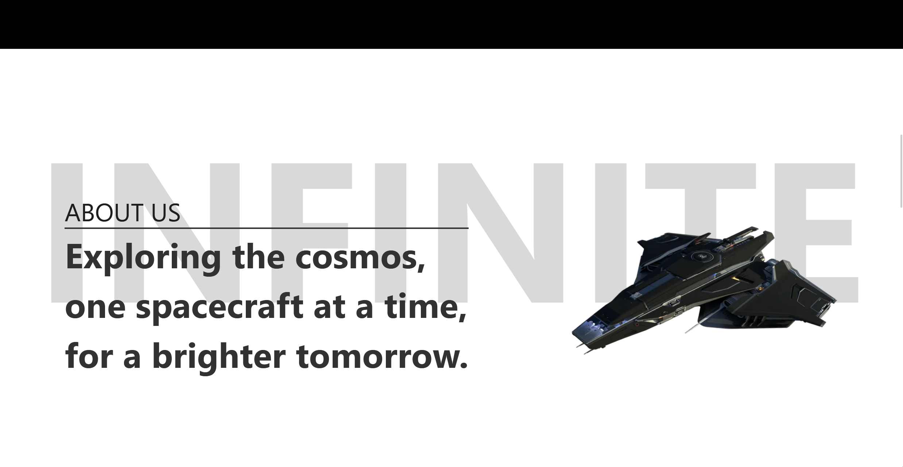

# Starway - Spacecraft Shop

Welcome to **Starway**, a fictive spacecraft dealership set in the Star Citizen universe. This project is built using React to help you continue learning and mastering React.

## Project Overview

A simple page for a fictive spacecraft dealership, this project was a way for me to learn more about react developpement

## Preview

Here are some preview images of the application:





## How to Run the Project

To run the project locally, follow these steps:

1. **Clone the repository:**
    ```bash
    git clone https://github.com/ben4ali/Starway-react.git
    ```

2. **Navigate to the project directory:**
    ```bash
    cd starway
    ```

3. **Install the dependencies:**
    ```bash
    npm install
    ```

4. **Start the development server:**
    ```bash
    npm start
    ```

5. Open your browser and go to `http://localhost:3000` to see the application in action.

Happy coding!